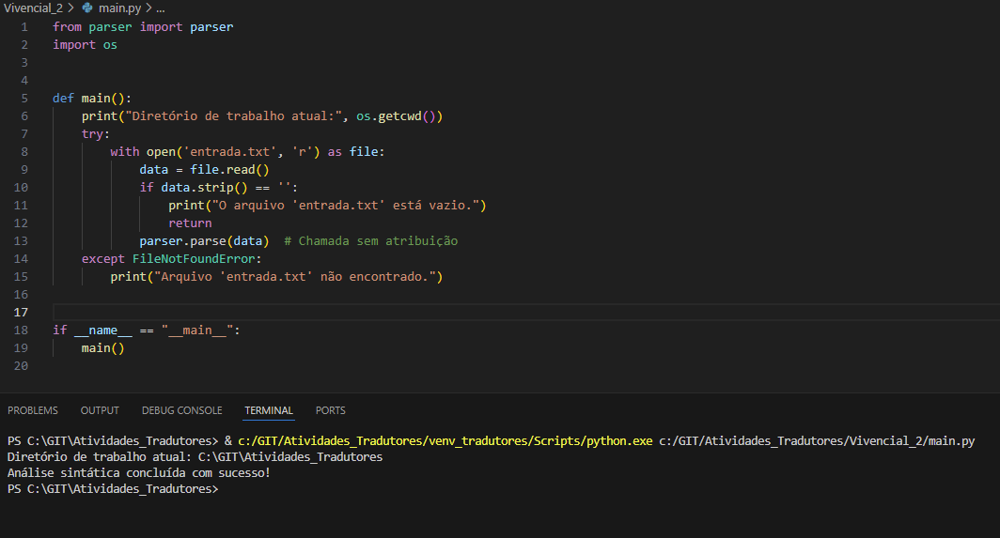
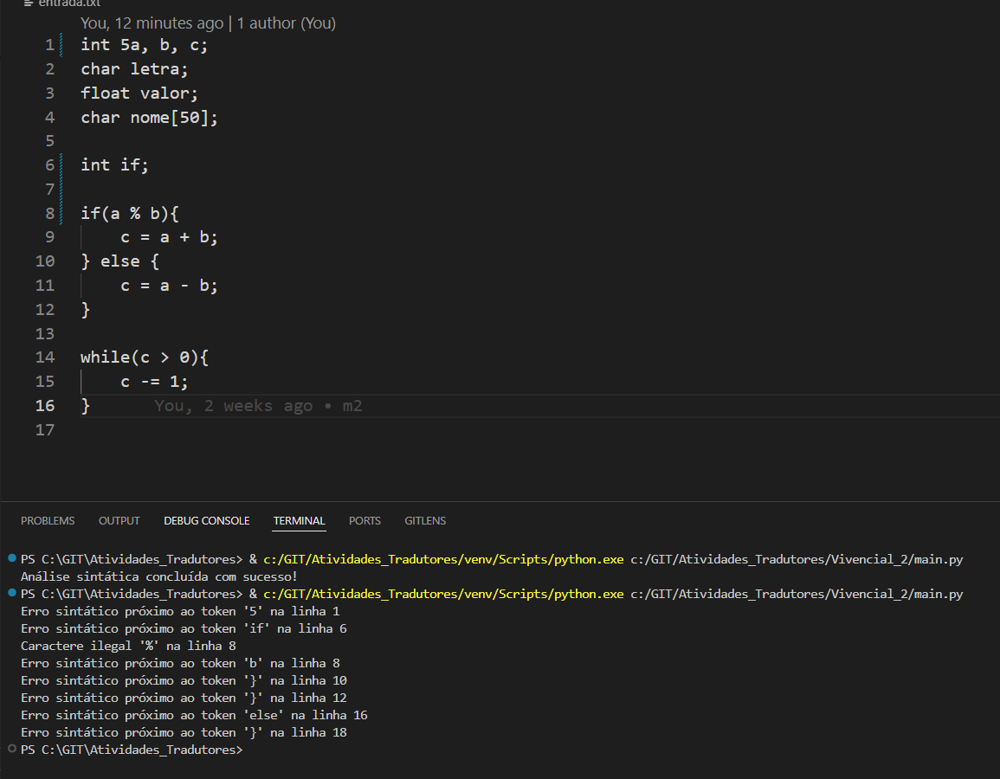

# Analisador Léxico e Sintático para Declaração de Variáveis e Comandos de Controle no Estilo da Linguagem C

## Especificações Gerais

Este projeto constrói analisadores léxicos e sintáticos em Python, utilizando a biblioteca PLY, para reconhecer declarações de variáveis e comandos de controle (`if/else` e `while`) inspirados na linguagem C.

### Tipos Reconhecidos:

- **Tipos**: `char`, `int`, `float`.
- **Declarações de `char`**: Caractere único ou um array de caracteres. Exemplos: `char a;`, `char a[10];`.
- **Declarações de `int`**: Compreende todos os valores inteiros. Não há restrições específicas de valores.
- **Declarações de `float`**: Compreende todos os valores reais com casas decimais (ponto flutuante). Não há restrições específicas de valores.
- **Identificadores**: Devem iniciar com uma letra ou `_`, seguidos por letras, dígitos ou `_`. O único caractere especial permitido é `_`.
- **Declarações**: Podem ser individuais ou em uma lista separada por vírgulas. Exemplo: `int a, b, c;`.
- **Finalização**: Cada declaração termina com ponto-e-vírgula (`;`).

### Comandos de Controle:

#### Comando `if`:

- **Sintaxe**: `if(condição) { <comandos> } else { <comandos> }`
- O comando `else` é opcional.
- As condições podem utilizar operadores relacionais, conforme especificado abaixo.

#### Comando `while`:

- **Sintaxe**: `while(condição) { <comandos> }`
- O bloco de comandos pode conter operações matemáticas e atribuições.

### Operadores Reconhecidos:

#### Operadores Matemáticos:

| Operador | Exemplo | Descrição |
|----------|---------|-----------|
| +        | a + b   | Soma      |
| -        | a - b   | Subtração |
| *        | a * b   | Multiplicação |
| /        | a / b   | Divisão   |

#### Operadores Relacionais:

| Operador | Exemplo  | Descrição                 |
|----------|----------|---------------------------|
| ==       | a == b   | Igualdade                 |
| !=       | a != b   | Diferente                 |
| <        | a < b    | Menor que                 |
| >        | a > b    | Maior que                 |
| <=       | a <= b   | Menor ou igual a          |
| >=       | a >= b   | Maior ou igual a          |

#### Operadores de Atribuição:

| Operador | Exemplo  | Descrição                              |
|----------|----------|----------------------------------------|
| =        | a = b    | Atribuição simples                     |
| +=       | a += b   | Soma e atribui                         |
| -=       | a -= b   | Subtrai e atribui                      |
| *=       | a *= b   | Multiplica e atribui                   |
| /=       | a /= b   | Divide e atribui                       |

## Gramática

A seguir está a gramática em Notação BNF (Backus-Naur Form) utilizada para o projeto:

```
<programa>           ::= <lista_declaracoes_comandos>

<lista_declaracoes_comandos> ::= <declaracao_comando>
                               | <lista_declaracoes_comandos> <declaracao_comando>

<declaracao_comando> ::= <declaracao>
                       | <comando>

<declaracao>         ::= <tipo> <lista_variaveis> ';'

<tipo>               ::= 'char'
                       | 'int'
                       | 'float'

<lista_variaveis>    ::= <variavel>
                       | <lista_variaveis> ',' <variavel>

<variavel>           ::= <identificador>
                       | <identificador> '[' <numero_inteiro> ']'

<identificador>      ::= <letra_ou_sublinhado> <letras_digitos_sublinhados>*  

<letra_ou_sublinhado>::= [a-zA-Z_]

<letras_digitos_sublinhados> ::= [a-zA-Z0-9_]*

<numero_inteiro>     ::= [0-9]+

<comando>            ::= <comando_if>
                       | <comando_while>
                       | <comando_atribuicao>

<comando_if>         ::= 'if' '(' <condicao> ')' '{' <lista_comandos> '}' <opcional_else>

<opcional_else>      ::= 'else' '{' <lista_comandos> '}'
                       | ε

<comando_while>      ::= 'while' '(' <condicao> ')' '{' <lista_comandos> }'

<lista_comandos>     ::= <comando>
                       | <lista_comandos> <comando>

<comando_atribuicao> ::= <identificador> <operador_atribuicao> <expressao_aritmetica> ';'

<condicao>           ::= <expressao_aritmetica> <operador_relacional> <expressao_aritmetica>

<expressao_aritmetica> ::= <termo> <resto_expressao>

<resto_expressao>    ::= '+' <termo> <resto_expressao>
                       | '-' <termo> <resto_expressao>
                       | ε

<termo>              ::= <fator> <resto_termo>

<resto_termo>        ::= '*' <fator> <resto_termo>
                       | '/' <fator> <resto_termo>
                       | ε

<fator>              ::= <identificador>
                       | <numero>
                       | '(' <expressao_aritmetica> ')'

<operador_atribuicao>::= '='
                       | '+='
                       | '-='
                       | '*='
                       | '/='

<operador_relacional>::= '=='
                       | '!='
                       | '<='
                       | '>='
                       | '<'
                       | '>'

<numero>             ::= <numero_inteiro>
                       | <numero_real>

<numero_real>        ::= [0-9]+ '.' [0-9]+

<empty>              ::= ε
```

## Observações

- **Finalização**: Cada comando e declaração é finalizado com ponto-e-vírgula (`;`).
- **Declarações de Variáveis**: As variáveis seguem a gramática de identificadores descrita e podem ser declaradas de forma individual ou em listas.
- **Comandos `if` e `while`**: Contêm operações matemáticas e atribuições dentro de seus blocos, que são executados conforme as condições especificadas.

## Implementação

A implementação foi realizada em Python utilizando a biblioteca PLY (Python Lex-Yacc), que possibilita a criação de analisadores léxicos e sintáticos.

### Analisador Léxico (lexer.py)

O analisador léxico (`lexer.py`) reconhece tokens como identificadores, números, operadores, e palavras reservadas (`char`, `int`, `float`, `if`, `else`, `while`).

### Analisador Sintático (parser.py)

O analisador sintático (`parser.py`) utiliza as regras definidas na gramática para construir a árvore sintática e validar a correção da estrutura do código de entrada.

### Arquivo de Entrada (entrada.txt)

O código a ser analisado é fornecido em um arquivo de entrada (`entrada.txt`), que contém declarações de variáveis e comandos no estilo da linguagem C.

## Instruções de Execução

1. **Instalação da Biblioteca PLY**:

   ```bash
   pip install ply
   ```

2. **Criação dos arquivos de código e entrada** conforme o especificado.

3. **Execução do programa principal**:

   ```bash
   python main.py
   ```

4. **Saídas**:

   - Em caso de sucesso, a mensagem "Análise sintática concluída com sucesso!" é exibida.
   - Em caso de erro, mensagens de erro apropriadas são fornecidas.

## Exemplo de Arquivo de Entrada (entrada.txt)

```c
int a, b, c;
char letra;
float valor;
char nome[50];

if(a == b){
    c = a + b;
} else {
    c = a - b;
}

while(c > 0){
    c -= 1;
}
```

---


## Print do main.py sendo executado:
### Sem erros


### Teste com erros
