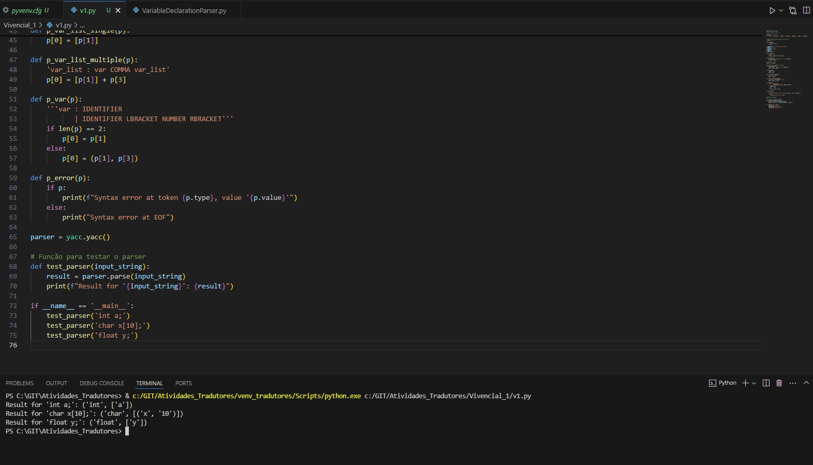

# Explicação Técnica do Analisador Léxico e Sintático

## Visão Geral
Este documento fornece uma visão geral e explicação técnica do analisador léxico e sintático desenvolvido para reconhecer declarações de variáveis nos tipos `char`, `int`, e `float` em uma linguagem de programação inspirada em C. O código utiliza a biblioteca Python PLY, que é uma implementação de Lex e Yacc.

## Componentes do Código

### Tokens
A definição de tokens é crucial para o processo de análise léxica. Os tokens definidos no código incluem:
- `TYPE`: Para os tipos de dados `char`, `int`, e `float`.
- `IDENTIFIER`: Para identificadores de variáveis.
- `NUMBER`: Para números usados em dimensões de arrays.
- `LBRACKET` e `RBRACKET`: Para delimitar as dimensões de arrays.
- `COMMA`: Para separar variáveis na declaração.
- `SEMICOLON`: Para indicar o fim de uma declaração.

### Lexer
O lexer é configurado para reconhecer os tokens baseados em expressões regulares:
- `t_TYPE`: Captura as palavras-chave `char`, `int`, e `float`.
- `t_IDENTIFIER`: Captura identificadores que começam com uma letra ou sublinhado, seguidos por letras, números, ou sublinhados.
- `t_NUMBER`: Captura sequências numéricas.

Além disso, espaços e tabs são ignorados, e novas linhas são tratadas para manter o controle da linha atual.

### Parser
O parser é construído usando as regras definidas para estruturar como os tokens são combinados para formar declarações válidas:
- `declaration`: Define uma declaração completa, consistindo de um tipo, lista de variáveis, e um ponto-e-vírgula.
- `type`: Captura o tipo de dado da variável.
- `var_list`: Pode ser uma única variável ou uma lista de variáveis separadas por vírgulas.
- `var`: Define uma variável como um simples identificador ou como um array com uma dimensão específica.

### Função de Teste
A função `test_parser` permite testar o parser com strings de entrada específicas para verificar se o analisador está funcionando como esperado.

## Execução
O script principal executa o parser em algumas declarações de exemplo para demonstrar sua funcionalidade. Os resultados mostram que o parser consegue corretamente identificar os componentes de cada declaração, como o tipo de dado e os identificadores das variáveis.

